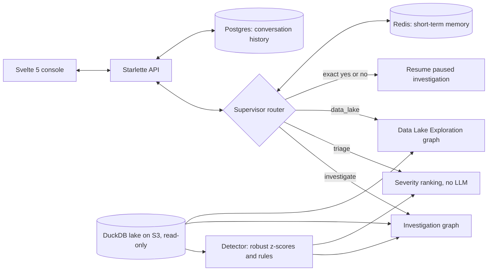
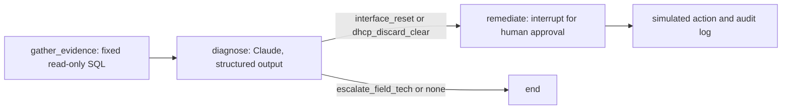
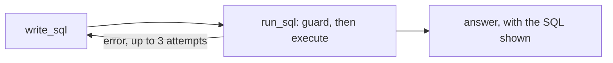

# AgentNet

A small network operations agent platform for DOCSIS cable networks, built with LangGraph. An
anomaly detector flags cable modems that drift from their own baseline. An investigation agent
gathers evidence from a data lake, diagnoses the root cause with Claude, and proposes a fix that
runs only after a human approves it. A supervisor puts it behind a chat, alongside a second agent
that answers plain-English questions with read-only SQL. Everything is evaluated against planted
incidents with known answers.

It runs on synthetic data and simulates every remediation. It is a working prototype, not a
production system; see [Limitations](#limitations).

## Architecture



**Investigation graph** (`agents/investigation.py`):



**Data Lake Exploration graph** (`agents/dle.py`):



## What each part does

| Part | File | What it does |
|---|---|---|
| Data generator | `ingest/generate_data.py` | Six DOCSIS tables (topology, device config, telemetry, syslogs, SNMP traps, DHCP events) for 2 CMTS and 20 cable modems over 24 hours. Plants six incidents: two each of RF impairment, DHCP storm, and interface flapping. Seed 42 makes every run identical. |
| Lake loader | `ingest/load_lake.py` | Loads the parquet files into a DuckDB file. `--upload` publishes it to S3. |
| Detector | `detect/anomaly_detector.py` | One SQL query: robust z-scores (median and MAD) per modem for SNR and transmit power, plus rules for errors, DHCP DISCOVER bursts, and linkDown traps. Flags a modem only after two anomalous intervals. |
| Investigation agent | `agents/investigation.py` | Gathers evidence with fixed SQL, asks Claude for a structured diagnosis, and pauses at `interrupt()` before any remote action. RF faults escalate to a field tech. |
| Data Lake Exploration agent | `agents/dle.py` | Natural language to SQL. The schema is read from the lake itself. Every query passes `check_select` (one SELECT only; no file, network, or settings access) on a read-only connection. Results are capped at 50 rows. |
| Supervisor | `agents/supervisor.py` | Routes each chat message: investigate, triage, data lake, or respond. Approvals are an exact "yes" or "no" checked in code, never by the LLM. Triage ranks detector events by a fixed severity rule. |
| Memory | `agents/memory.py` | Short-term memory: a Redis checkpointer, 24-hour idle expiry. Long-term memory: a Postgres store holding every conversation. An expired conversation is reloaded from Postgres, so the agent keeps context. |
| Web console | `ui/api.py`, `ui/web/` | Anomalies with 24-hour SNR traces, conversation history, findings with evidence, an approval card, and an action log. |

## Results

All measured on the seed-42 dataset unless noted.

| What | Result |
|---|---|
| Detection | 6 of 6 planted incidents found, 0 false alarms on 14 clean modems |
| Detection, 50 held-out seeds | 0 missed of 300 incidents, 0 false alarms over 700 clean modem-days |
| Diagnosis | Root cause and action correct on 6 of 6 (2 of 2 per fault type); two runs agreed |
| Explanation groundedness | 64 of 64 cited numbers found in the evidence given to the model |
| Data Lake Exploration agent | 6 of 6 questions, execution-based check, each on the first attempt |
| Latency and cost | 5.2 to 8.0 s per investigation (median 6.6 s); about 1,300 to 1,450 tokens |

Treat these with care. There are only six incidents, the data is synthetic with clean signatures,
and the labels were set by the author, not by network SMEs.

## Setup

Prerequisites:
- Python 3.13
- Node 22
- Docker Desktop
- An Anthropic API key
- Optional: a LangSmith API key for tracing
- Optional: AWS credentials for the S3 lake

Run everything from `src/netops-agents`:

```bash
pip install -r requirements.txt
```

Copy `.env.example` to `settings.ini` and fill in your keys. `settings.ini` is git-ignored. Set
`LANGSMITH_TRACING=true` to trace runs in LangSmith. Leave `S3_LAKE_BUCKET` empty to use the local
lake file.

Generate the data and build the lake. This also writes the gold labels to `eval/gold_dataset.jsonl`:

```bash
python ingest/generate_data.py
```

```bash
python ingest/load_lake.py
```

Add `--upload` to the second command to publish the lake to the S3 bucket in `S3_LAKE_BUCKET`.

Start the memory services (Redis and Postgres):

```bash
docker compose up -d
```

## Run

Build the web console once (and again after UI changes):

```bash
npm install --prefix ui/web
```

```bash
npm run build --prefix ui/web
```

Then start the API, which also serves the console, and open http://127.0.0.1:8000:

```bash
python ui/api.py
```

For live UI development, run `npm run dev --prefix ui/web` alongside the API and open
http://127.0.0.1:5173.

Command-line alternatives:
- `python -m agents.supervisor` starts a chat in the terminal.
- `python -m agents.investigation` investigates every detected anomaly, asking you to approve each
  remote action.
- `python -m agents.dle "How many cable modems are on CMTS-WEST-01?"` asks the data lake one
  question.

## Evaluate and test

```bash
python -m eval.run_eval
```

```bash
python -m eval.run_dle_eval
```

```bash
python -m pytest tests
```

- **`eval.run_eval`:** scores detection (precision, recall, F1, false-alarm rate) and diagnosis
  (root cause and action accuracy, per fault type) against the planted labels. It calls Claude
  once per incident.
- **`eval.run_dle_eval`:** runs each of the data lake agent's queries next to a reference query
  and checks the answers match.
- **`pytest`:** four tests that never call the LLM:
  - the detector flags exactly the planted modems.
  - the triage order.
  - the SQL guard blocks six attack patterns.
  - the config reader works. This one needs a `settings.ini` with `LANGSMITH_TRACING=true` and an
    Anthropic key.

## Design choices

- **The LLM only where judgment is needed.** Evidence gathering, detection, and triage are
  deterministic code. Claude diagnoses, writes SQL, and routes chat messages.
- **Outputs constrained by schema.** Diagnoses and routes use structured output with fixed labels,
  so the model can only pick a valid root cause and action.
- **The model never approves.** Remote actions run through one code path, after an exact human yes.
- **The answer key stays out of reach.** Gold labels live in `eval/`, never in the data lake the
  agents can query.
- **Read-only by default.** Agents open the lake read-only, and model-written SQL is checked before
  it runs.

## Limitations

- The data is synthetic with clean fault signatures, and the author set the labels.
- The eval sets are small: six incidents and six SQL questions.
- The diagnosis prompt knows three fault types. Its response to an unfamiliar fault is untested.
- Each investigation covers one modem; there is no cross-device correlation yet.
- A pending approval lives in process memory, so a server restart expires it. The agent says so and
  runs nothing.
- The SQL guard is a keyword blocklist on a read-only connection. Production would also need a
  database role that can only SELECT.
- The API has no authentication, so it listens only on this machine (127.0.0.1).

## Roadmap

1. A larger, harder eval: ambiguous cases, faults outside the three known types, and SME labels.
2. Cross-device correlation, such as many modems failing under one CMTS.
3. A recommendation agent that retrieves vendor documentation and topology to justify a fix.
4. An MCP server for live device status.
5. GitLab CI running the tests and the evals as a merge gate, then deployment.
